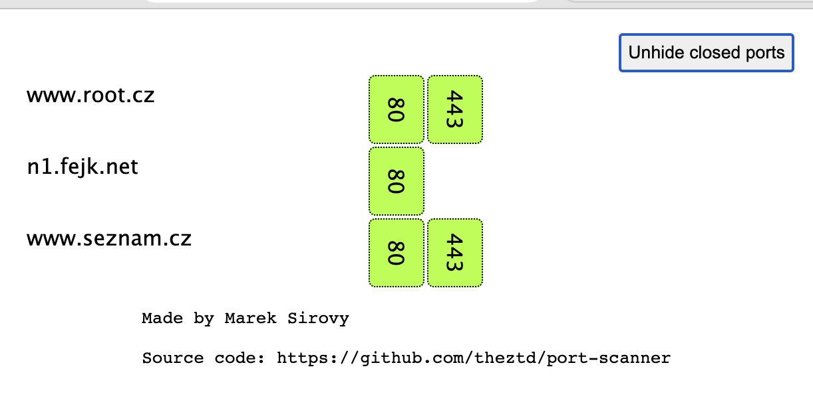

[](https://github.com/theztd/port-scanner/actions/workflows/release.yml)
[](https://github.com/theztd/port-scanner/actions/workflows/build_and_deploy.yml)

# portScaner

Scan defined ip's for open ports



Look at [./example-status.htm](example-status.htm) file. It is an example of the result...

## Usage

```bash
Usage of portscanner:
  -in string
        Path to the file with hosts (One line = one host)
  -out string
        Path to the output file.
  -ports string
        Custom port definition (example "22,80,443,9100-9200,5432") (default "1-1200,1900,2049,2379-2380,2483,2484,3306,3389,4646,5000-5005,5060,5432,6379,6443,6881,6999,8080,8300,8500,9200,9300,9100,10250,10257,10259,30000-32767")
  -template string
        Name of the output template (build in are: json, prometheus, html). (default "html")
  -template-file string
        Path to the custom template file.
```

## Examples


### Generate report as a html page

You can send this html page via email, put it to the cloudflare, ...

```bash
portscanner -quick -in servers.txt > /var/www/nginx/status/openports-$(date +%F).html
```


### Generate json output

```bash
portscanner -quick -in servers.txt -template json  > data.json
```
Than you can sent it via curl to any api endpoint or object storage.

### Generate prometheus output

```bash
portscanner -quick -in servers.txt -template prometheus  > textfile_portscanner.prom
```

### Own template

Simply add your template by parametr -template-file. And provide your template name as a parametr ;-)

```bash
portscanner -quick -in servers.txt -template template.json -template-file .my_templates/template.json
```
